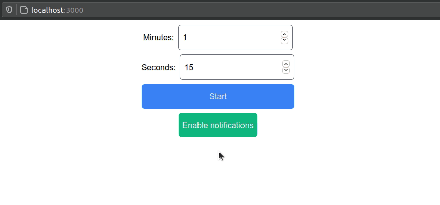

# react-timer

Simple timer application written in React. Used as a practice.



## Tech stack

- [WindiCSS](https://windicss.org/)
- [Vite](https://vitejs.dev/)
- TypeScript

## Running the project

```shell
yarn # Installing dependencies
```

### Development

```shell
yarn dev
```

### Build

```shell
yarn build
```

### Preview

```shell
yarn serve
```
